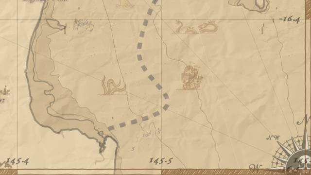
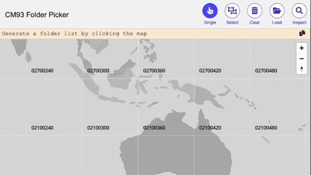
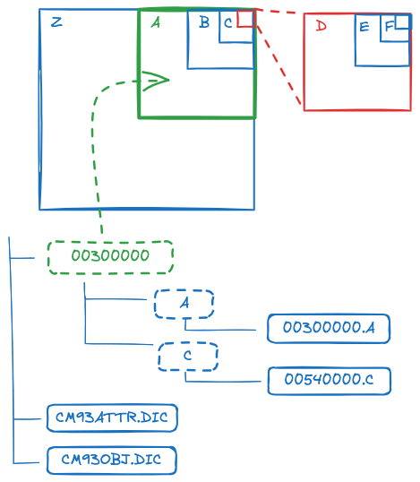

# Node CM93

Parse CM93 v2 sea charts with vanilla javascript!

`node-cm93` is a console application with a simple [html map inspector ↗](https://nilsheuman.github.io/node-cm93/bin/folder-picker.html).



Sample Chart with some extras rendered with [MapLibre](https://maplibre.org/).

## Features

- Reads and decodes sea chart data files
- Converts coordinates from tile xy coordinates to longitude, latitude with offsets
- Creates polygons from unsorted curves of area segments
- Outputs GeoJson for vector rendering with MapLibre
- Map viewer with inspector for datasets and geojson

## Usage

Below is an animation of the typical workflow



First locate your map data folder containing `CM93ATTR.DIC` and a list of folders starting with `00300000`.
The folder containing this is your `input-path`.

Then clone this repository. The main script is in `bin/app.js`.

To understand the folder structure, open [folder-picker.html](bin/folder-picker.html) in your browser. This visualizes the
world location each folder contains. It works locally with no server but requires network connection for loading the map libraries.

Parsing files requires Node.js. No additional dependencies are needed to run the parser.

With nodejs installed, open a terminal window and run something like below:

## Running

```
> node node-cm93/bin/app.js scan -i cm93files/ -o cm93json/ -id 02100420,01500420
```
```
    Scanning...
    100%             716/716 cm93files/01500420/G/D1680453.G
```
This runs the `scan` command with `input-path` = `cm93files/` and `output-path` = `cm93json/` targeting the two folders `02100420` and `01500420`.

When executed, the program will look into the `cm93files/` folder for the folders `02100420` and `01500420` and for each folder read all files they are containing. The `scan` command only reads the header of the file to figure out its location. Once finished it will output a geojson file into `cm93json/folder-scan.json` containing the positions of each file as a polygon and a point in South West corner.

This file can be loaded into the [folder-picker.html](bin/folder-picker.html) [↗](https://nilsheuman.github.io/node-cm93/bin/folder-picker.html) for a visual preview, showing location and a label. The inspector button shows information of entities on the map that the mouse is hovering, click to lock and right click to unlock.

This is helpful when generating the actual chart files. To generate chart files the command below can be used.
```
> node node-cm93/bin/app.js parse -i cm93files/ -o cm93json/ -id 02100420 -l BD
```
```
    Parsing...
    100%             137/137 cm93files/02100420/D/02640444.D
```
This runs the `parse` command with `input-path` = `cm93files/` and `output-path` = `cm93json/` targeting the folder `02100420`, limiting the data levels to `B` and `D`.

When executed, the program will look into the `cm93files/` folder for the folder `02100420` and in that folder look in the folders `B` and `D` and read all the files in these folders. Each file will be parsed and a geojson file will be created in `cm93json/<top-folder>_<level>_<filename>.json`, for example `02100420_B_02100420.B.json`

This file can be loaded into the [bin/folder-picker.html](folder-picker.html) and with the inspector all features properties can be shown.

### Advanced Usage

The program outputs a help prompt if invalid input is passed.
```
usage: node script.js -m <mode:scan|parse> -i <input-path> -o <output-path>
                      [-ad <attr-dict>] attribute dictionary, default CM93ATTR.DIC
                      [-od <obj-dict>] object dictionary, default CM93OBJ.DIC
                      [-l <levels>] levels to include, default ZABCDEFG
                      [-id <input-directories,>] folders to scan for files, comma separated, relative to input-path
                      [-if <input-files,>] files to parse, if empty, the input-path will be scanned
                      [-sf <filename] scan output file name, relative to output-path, default folder-scan.json
                      [-f <json|raw>] output format, default json
                      [-d <level:0,1>] debug level, default 0
                      [-ox <x>] offset x, default 0
                      [-oy <y>] offset y, default 0
```
Note that `-id` and `-if` are mutally exclusive. They are both comma separated lists and should contain the relative path from the `input-path` folder.

To output the raw CM93 data without any transformations or filtering, supply `-f raw`.

To transform coordinates with offsets `-ox <x>` and `-oy <y>` can be passed, these should work similar to OpenCpn offsets with meter offsets.

### Using the data

The geojson files can be rendered directly as shown in the preview html-file, but can also be merged into mbtiles files. Since the levels are overlapping and even if the bounding box of a layer reports once size, the actual data may be smaller. The actual bounding box of the data can be seen if inspecting the `cmtype`, `_m_sor` in the geojson.

No magic bullet have been found for dealing with the overlapping data, current flow is to generate two map files, one lower levels covering wide area, and another one with more detailed levels on higher zoom levels. Grouping `ABC` in the wide and `DEFG` in the narrower. And then with the maplibre layer config let the layers be rendered with lower details in the bottom (by putting them in a layer before the later).

To merge geojson files there is a great utility [Tippecanoe](https://github.com/mapbox/tippecanoe/), install it and run the following

```
tippecanoe -o cm93-ABC.mbtiles \
  cm93json/*.A.json \
  cm93json/*.B.json \
  cm93json/*.C.json \
  --force --minimum-zoom=0 --maximum-zoom=6
```
This creates a mbtiles file with data from levels A,B,C with minimum zoom 0 and max zoom 6

```
tippecanoe -o cm93-DEFG.mbtiles \
  cm93json/*.D.json \
  cm93json/*.E.json \
  cm93json/*.F.json \
  cm93json/*.G.json \
  --force --minimum-zoom=6 --maximum-zoom=12
```
This creates a mbtiles file with data from levels D,E,F,G with minimum zoom 6 and max zoom 10

Most of the detail is kept (these charts are a bit dated and not fully accurate anyway) but there is definitely data loss compared to the geojson especially seen on layer `SLCONS` (Shoreline construction). To have this accurate on level F, the max zoom 18 was needed but that creates massive mbtiles files. The approach above gives a reasonable result with decently small files.

Attemps on joining these maps with `tile-join` seems unsuccessful, likely due to too much information on the tiles.

Converting the mbtiles to pmtiles for webserver access without having to run a mbtile server can be useful. This can be done with [PMTiles](https://github.com/protomaps/PMTiles). Install PMTiles and run the command below to create a pmtiles file. This can be stored on for example AWS S3.

```
pmtiles convert cm93-DEFG.mbtiles cm93-DEFG.pmtiles
```

# CM93 Data format

The distributed files have dictionaries in the top folder for looking up the data types and describing the objects.

The folder structure represents coordinates, changing with +20 lat/lon degrees per folder to cover the planet.

Each folder have some of the subfolders `Z,A,B,C,D,E,F,G` which each represents a smaller subset,
not all folders are available everywhere, often there are overview data, and the more detailed folders
are for harbours and popular destinations. The `A` folder is representing the top folder name covering that bounding box.

*NOTE:* Folders containing both for example `D` and `F` will have overlapping data, and even that the data files
specify their bounding box, the more detailed data does not cover the full area, no logic has been added for
substitution of the overlapping data.




The datafiles are a stream of bytes, where each byte is encoded, the script decodes and parses to different datatypes
to create the objects of coordinates and attributes.

Overview of the data format

See more detailed documentation of the format in [docs/cm93-data-format.md](docs/cm93-data-format.md)

# GeoJson format

To ease layer making in MapLibre, most features are put on the same layer when generating maps with Tippecanoe.
This by adding a property `tippecanoe` with a sub property `layer` with the value of the layername:
```
"tippencanoe": {"layer": "DEPARE"}
```
Currently only five layers are used `DEPARE` `LNDARE` `ITDARE` `SYMBOL` and `OTHER`.
So layers can be catch all. A property `sortKey` is added to distinguish from what detail
the data have come from, a higher value for a higher detail, this is generated from the filenames extension.

The example below shows `sortKey: 5` which represents `F` detail. The sortKey is useful for placing higher
detail data above lower detail data. The drawback is that currently no way to easily sort layers so they have
to be duplicated to cover each other. But generally there is a E or F detail of most interesting places in the
world, and these charts should probably not be used for anything more detailed than that. So a base layer could be
generated from A or B and then E and F to cover for more detail.

All properties are passed on from the raw data to the json. The interesting ones are:
- `DRVAL1` lowest depth
- `DRVAL2` highest depth
- `_texta` text field
- `text` text field, likely fetched from `OBJNAM`
- `typeLabel` description text by looking up the object type in the object dictionary
- `cmtype` object type name from the attr dictionary
- `sortKey` describing the detail level of the source data


The header gives a hint of the bounding box of the data and what values that have been used to convert from xy to latlon.

```
{
  "type": "FeatureCollection",
  "header": {
    "lonMin": 145.333329840873,
    "latMin": -16.666666303450,
    "lonMax": 145.666663118327,
    "latMax": -16.333332942177,
    "eastingMin": 16179069.0908848,
    "northingMin": -1882131.3711644,
    "eastingMax": 16216177.042186,
    "northingMax": -1843429.5998565,
    ...
  },
  "features": [
    {
      "tippecanoe": {
        "layer": "DEPARE"
      },
      "type": "Feature",
      "geometry": {
        "type": "MultiPolygon",
        "coordinates": [[[
            [145.46985867591602,-16.487917365567256],
            [145.46980272617793,-16.487998752224403],
            [145.46976712179915,-16.488080138847327],
            [145.46972643108055,-16.488181872077867]
        ]]]
      },
      "properties": {
        "iobject": 4,
        "otype": 44,
        "geotype": 132,
        "cmtype": "DEPARE",
        "typeLabel": "Depth area",
        "file": "02200436.F",
        "sortKey": 5,
        "DRVAL1": 2,
        "DRVAL2": 5
      }
    }
  ]
}
```


## Requirements
- CM93 v2 chart data files
- [NodeJS](https://nodejs.org) for running the scripts
- [Tippecanoe](https://github.com/mapbox/tippecanoe/) optional, for creating mbtiles with merged json files
- [PMTiles](https://github.com/protomaps/PMTiles) optional, for converting mbtiles to pmtiles for web access

# Development

This simple console app suffered a bit of feature creep but it still requires no dependencies needed for running. Some dev dependencies have been added for linting and a few type files. Development have been done in vscode.

```
npm install
```

Testing is done with jest, using experimental features to handle ES Modules.
Fairly rudimentary but trying to cover the parsing by constructing a mocked binary file and reading it back.
```
npm run test
```

The console app lives in `bin/app.js` with a very minimal input parsing and error feedback. It can be run on sample data that will generate a geojson with a famous triangle.

First create an output folder `tmp`
```
mkdir tmp
```

Then run the command to parse the sample file and generate a geojson.
```
node bin/app.js parse -i tests/resources -o tmp -ad tests/resources/sample-attr.dic -od tests/resources/sample-obj.dic -if 03300840.B
```

A good starting point is `lib/cm93.js` and see the `HandlerParse` class. The idea is to first parse the data file to an intermittent object, and then the geojson can be created from that with filtering and transformations.

The categorization of types is defined in `lib/geojson/types.js`, here layers are named, grouped and disabled.

For the visualization, check `json-polygon-depth` layer in `bin/folder-picker.html`, it gives a good overview of the `cmtype` depth layers.


## Disclaimer
```
* Generated output may not be accurate and should not be used for navigation.
* No real chart data is available in this repository.
```