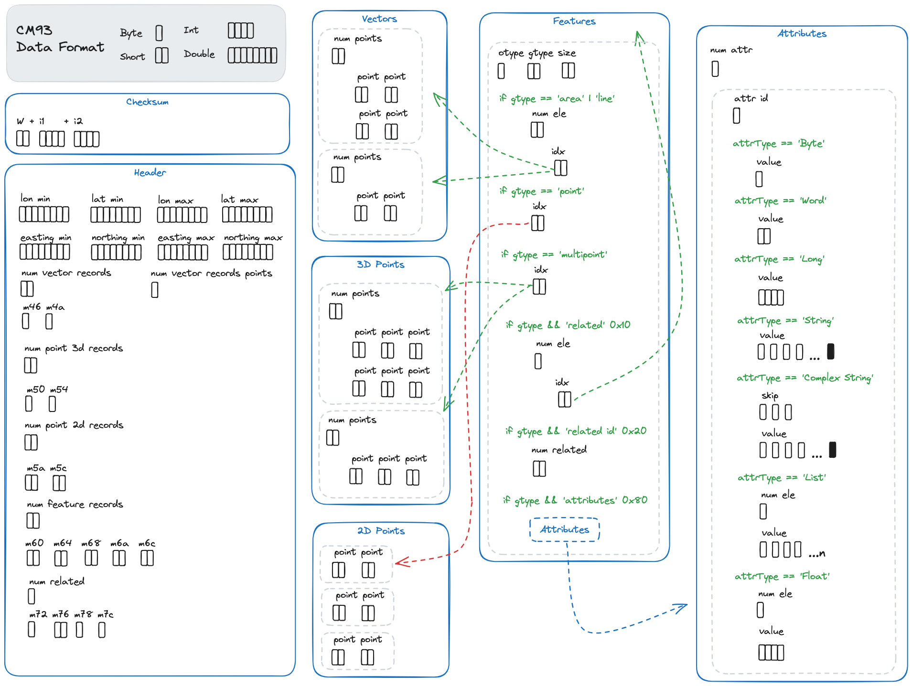

# CM93 Data Format

*This is not a specification, rather a minimum understanding documentation of reverse engineered data for the parsing .*

The data is a stream of bytes from top to bottom, each byte is encoded and a lookup table is used before converting to the data types.

First a header contains the boundingbox and the sizes of the different arrays of points. Then the arrays of points in sets of vector, 3d points, 2d points and then the array of features with its attributes, depending on the type of feature, it will point to different indexes of the point arrays.

Below is a simplified drawing on the parts that makes up the data.


Data is stored in `byte`(1), `short`(2), `int`(4), `float`(4) and `double`(8) entries(byte size).

A more detailed figure of each segment. Showing the data structures and how they are linked together.



## Psuedo Data Parser

A textual representation of the data format sections, with psuedo code of the parser.

### Checksum
```
checksum: short int int
```
### Header
```
coords: double double double double

eastins: double double double double

vector records: short int

misc: int int

point3d records: short

misc: int int

point2d records: short

misc: short short

feature records: short

misc: int int short short short

related: int

misc: int short int int
```
### Vector table
```
for record_count
    num_pts = short
    for num_pts
        point = short short
```
### 3D Points
```
for record_count
    num_pts = short
    for num_pts
        point = short short short
```
### 2D Points
```
for record_count
    point = short short
```
### Features
```
for record_count
    otype, gtype, size = byte byte short

    # geo type
    case gtype & 0x0f
        'area'
            num_ele = short
            for num_ele
                idx = short
                read points from vector table[idx & 0x1fff]
        'line'
            num_ele = short
            for num_ele
                idx = short
                read points from vector table[idx & 0x1fff]
        'point'
            idx = short
            read points from 2d point table[idx]
        'multipoint'
            idx = short
            read points from 3d point table[idx]

    # related objects
    if gtype & 0x10
        num_related = byte
        for num_related
            idx = short
            (pointing to features list index)

    # number of related objects
    if gtype & 0x20
        num_related = short

    # attributes
    if gtype & 0x80
        num_attr = byte
        for num_attr
            id = byte
            case
                'Byte'
                    value = byte
                'Word'
                    value = short
                'Long'
                    value = int
                'String'
                    value = byte until 0
                'Complex String'
                    skip = byte byte byte
                    value = byte until 0
                'List'
                    num_elem = byte
                    for num_elem
                        value+=byte
                'Float'
                    value = float
```
